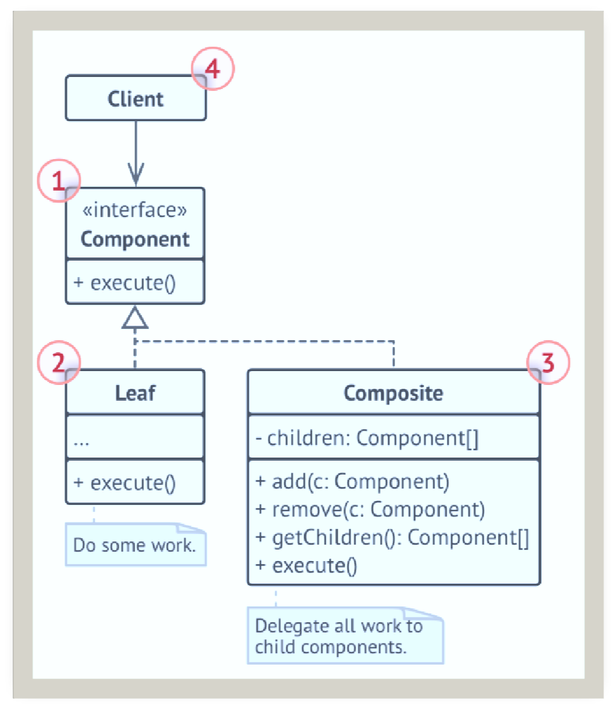

# 1. 简介     
组合模式（Composite Pattern）是一种结构性设计模式，允许将一组对象组织成树形结构以表示“部分-整体”的层次结构。使得用户对单个对象和组合对象的操作/使用/处理具有一致性。组合模式构造了一个树形的对象结构，并且通过一个属性对象可以可以访问整棵树的对象。        

# 2. 主要组成部分     

- 抽象组件（Component）：声明了叶子和组合对象的共同接口。
- 叶子组件（Leaf）：实现了组件接口，代表树中的叶子节点。
- 组合组件（Composite）：实现了组件接口，定义了叶子和子组件的行为，存储子组件。

# 3. 适用场景
- 需要表示“部分-整体”层次结构的场景，例如文件系统、组织结构等。
- 客户端需要统一处理单个对象和组合对象的场景。

# 4. 优缺点
组合模式的优点  
- 一致的接口：客户端可以使用相同的方式处理单个对象和组合对象。
- 简化代码：减少了客户端代码的复杂性，便于管理和扩展。
- 灵活性：可以轻松地添加新的叶子或组合类。

组合模式的缺点
- 设计复杂性：需要设计一个抽象组件接口，可能导致过多的类。
- 性能开销：在某些实现中，可能会有额外的性能开销，特别是在树结构较深时。

